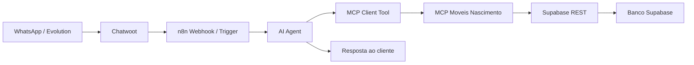

# MCP de Atendimento no n8n

Este e o caminho recomendado para simplificar o fluxo do atendente de IA: o agente do n8n decide a intencao da conversa e chama ferramentas MCP quando precisar ler ou registrar algo no sistema.

O MCP acessa o Supabase diretamente via REST com `SUPABASE_SERVICE_ROLE_KEY`. Ele deve ficar privado na VPS, acessivel pelo n8n via rede Docker.

## Arquitetura



## Configuracao no n8n

1. Rode o MCP:

```powershell
$env:SUPABASE_URL="https://SEU_PROJETO.supabase.co"
$env:SUPABASE_SERVICE_ROLE_KEY="service_role_key"
$env:MCP_AUTH_TOKEN="token_para_o_n8n"
npm run mcp
```

2. No workflow do n8n, adicione um `AI Agent`.

3. Conecte um `MCP Client Tool` ao agente.

4. Configure o MCP Client Tool:

- Transport: `SSE`
- SSE URL: `http://moveis-mcp:3030/sse` dentro da rede Docker, ou `http://SEU_HOST:3030/sse` em teste local.
- Header: `Authorization: Bearer token_para_o_n8n`

5. No prompt do agente, diga para ele usar o MCP apenas quando precisar consultar ou registrar dados do sistema.

## Prompt base recomendado

```text
Voce e o atendente comercial da Moveis Nascimento no WhatsApp.

Responda de forma curta, natural e util. Faca perguntas simples quando faltar informacao.

Use as ferramentas MCP somente quando precisar:
- buscar produtos no catalogo;
- consultar detalhes de produto;
- registrar interesse de compra;
- registrar observacoes importantes no lead;
- solicitar atendimento humano;
- consultar pedidos recentes ou status de pedido;
- procurar montadores.

Nunca invente preco, estoque, prazo ou status de pedido. Se nao houver dado retornado pela ferramenta, explique com transparencia e peca uma informacao objetiva.

Quando o cliente demonstrar intencao real de compra, orcamento, visita, entrega ou atendimento, use register_customer_interest com telefone, nome se disponivel e um resumo do pedido.

Se o cliente pedir humano, estiver irritado, falar de reclamacao sensivel ou o atendimento exigir decisao manual, use request_human_attendant.

Nao altere cadastro de produtos, nao exclua dados e nao prometa condicoes comerciais fora do que o sistema retornar.
```

## Ferramentas integraveis

- `search_products`: consulta catalogo por termo/categoria.
- `get_product_details`: detalha produto especifico.
- `register_customer_interest`: cria/reutiliza lead e registra interesse.
- `add_lead_note`: anota informacao na timeline do lead.
- `request_human_attendant`: encaminha para atendimento humano.
- `find_recent_orders_by_phone`: encontra pedidos recentes por telefone.
- `get_order_status`: consulta andamento de pedido.
- `search_installers`: lista montadores ativos por cidade.

## Seguranca

Este MCP foi desenhado para atendimento e leitura operacional. Ele nao expoe funcoes para deletar dados, editar produtos ou fazer mudancas sensiveis no cadastro. Essas acoes continuam manuais dentro do app.

Em producao, use sempre `MCP_AUTH_TOKEN`, mantenha o container em rede privada e proteja a `SUPABASE_SERVICE_ROLE_KEY`.
